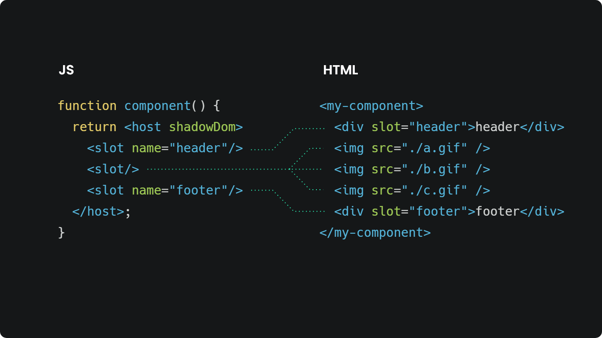
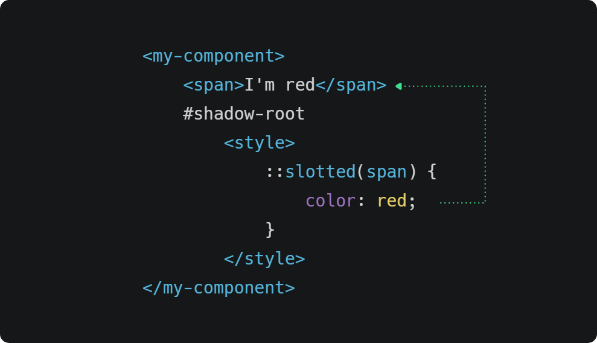

# Slots

El uso de slots mejora la composición permitiéndote reflejar el contenido expuesto en el `lightDOM` del componente en el `shadowDOM` de este, ejemplo:



### ::slotted\(&lt;selector&gt;\)

El selector `slotted`  permite la manipulación del contenido expuesto como slot del lightDOM desde el shadowDOM, ejemplo:



### Auto slot

Con Atomico puedes definir un slot por defecto para tus componentes, esto es útil si buscas mantener cierta consistencia de composición sin la necesidad de declarar el uso de slot, ejemplo:

```markup
<my-component>
    <my-component-header></my-component-header>
    <my-component-footer></my-component-footer>
</my-component>
```

Para definir un slot por defecto solo debes declarar en las props la prop slot, ejemplo:

```javascript
myComponentHeader.props = {
    slot: { type:String, value: "header"}
}

myComponentFooter.props = {
    slot: { type:String, value: "footer"}
}
```

Considere esto practico solo si la composición esta apalancada al contenedor, esto no evita que ud modifique la propiedad slot desde la instancia del componente

### Slot condicional.

Atomico ofrece un hook dentro del package [**@atomico/hooks/use-slot**]() ****que anexa el evento [**slotchange**](https://developer.mozilla.org/en-US/docs/Web/API/HTMLSlotElement/slotchange_event) a una referencia, este le permitirá ocultar slots si estos no declaran contenido, ejemplo:

```jsx
import { useRef } from "atomico";
import { useSlot } from "@atomico/hooks/use-slot";

function component(){
    const ref = useRef();
    const childNodes = useSlot(ref);
    return <host shadowDom>
        <header style={{
            display: childNodes.length? "block": "none"
        }}>
            <slot name="header" ref={ref}/>
        </header>
    </host>
}
```


